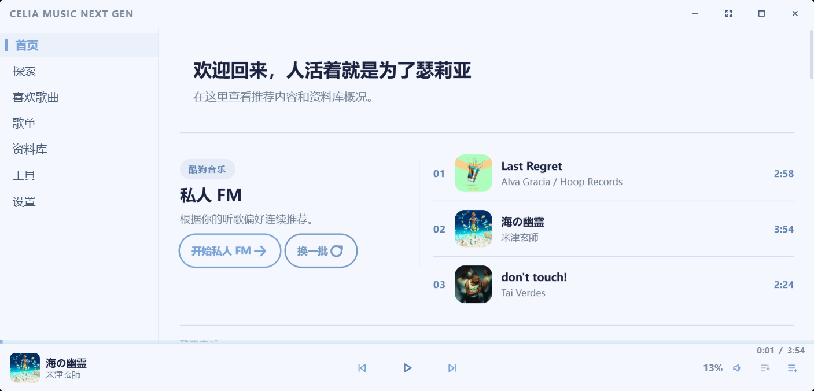
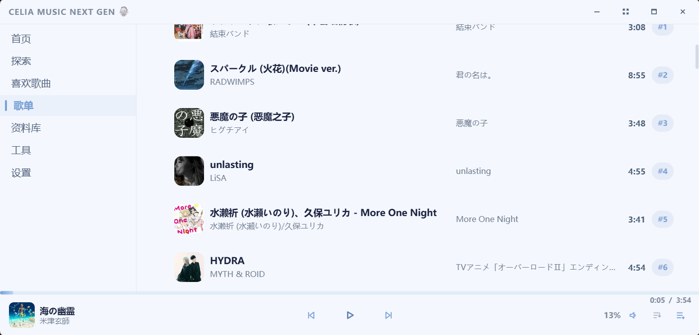
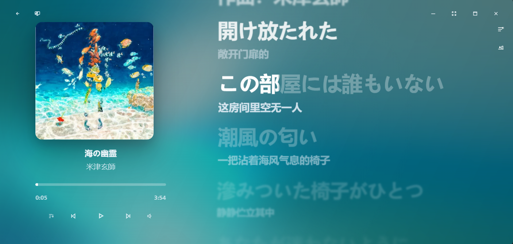
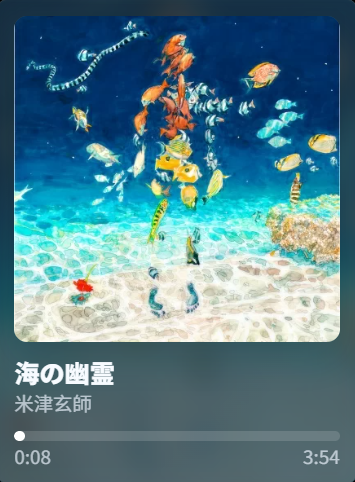
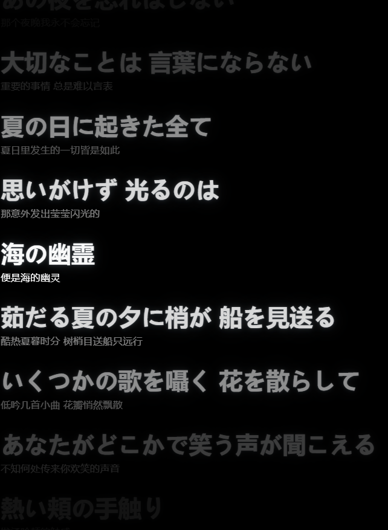

# Celia Music Next Gen

一款基于 Tauri 2 的桌面音乐播放器。本地音乐库、网易云音乐和酷狗音乐在线源、沉浸播放页及桌面小组件都在同一个应用里。目前主要面向 Windows；壁纸模式和 Wallpaper Engine 场景渲染使用 Windows 原生接口。

> 在线功能依赖音乐源 API。首次使用时，在「设置 > 网络」填写相关配置。账号、Cookie、代理和 API 地址只保存在本机应用数据目录。

## 功能

### 音乐库与播放

- 导入单个音频文件或整个文件夹；扫描目录和目录监听可在设置中指定。
- 查看、编辑歌曲标题、歌手、专辑等标签，导入或保存歌词文件，也可在线补全歌词。
- 播放列表、收藏、队列和上次播放进度会被记住。播放模式包括顺序、列表循环、单曲循环和随机。
- 播放页提供进度、音量、静音、频谱分析和系统媒体信息同步。
- 缓存可设为流式或完整下载，退出时还能自动清理。
- 歌曲过渡提供简易混音和自动混音两种方式，预加载与切歌时间均可调整。
- 10 段均衡器内置摇滚、爵士、流行、低音、电子和人声预设，也能逐段调整。

<p align="center">
  
  <br />
  <sub>首页将推荐内容、当前播放队列和底部播放控制栏放在同一视图中。</sub>
</p>

### 在线音乐与歌单

- 网易云音乐和酷狗音乐可分别启用。两者都能搜索歌曲、歌手、专辑，并浏览推荐、歌单和歌曲详情。
- 网易云音乐提供扫码或 Cookie 登录、账号资料、喜欢歌曲、每日推荐、私人 FM 和歌单管理。
- 酷狗音乐提供二维码或 Cookie 登录，并处理设备标识和播放音质回退。
- 可读取本地酷狗歌单 JSON，匹配网易云音乐曲目后导入目标歌单。自动匹配失败的歌曲可以手动搜索后重试。
- 在线歌曲会下载到指定目录并显示进度。歌词可写入音频标签，或另存为独立文件。
- API 地址、超时、网易云 Cookie、代理和 Real IP 都能单独设置。也可以由应用启动本地网易云 API 或酷狗 API，或连接已经运行的服务。

<p align="center">
  
  <br />
  <sub>歌单页展示曲目、专辑和时长，底部播放栏会持续保留当前播放状态。</sub>
</p>

### 歌词、沉浸播放与桌面能力

- 沉浸播放页显示逐行歌词，并提供进度预览、淡入淡出、模糊、曲线和对齐选项。
- 歌词的字体、字重、字号、行距、阴影、发光、延迟和动画速度都能单独调整。
- 背景可以沿用主题或歌曲封面，也可以换成自定义图片、视频、MV、封面模糊或流体效果。
- 全局效果包括线条、粒子、雪、樱花、雾、泛光和雨，可调节前后景层级、密度、尺寸、速度、透明度和范围。
- Windows 下可以启用沉浸式壁纸模式，并加载部分 Wallpaper Engine项目。
- 系统托盘可打开主窗口或组件控制窗口、刷新应用和退出；应用按单实例运行。

<p align="center">
  
  <br />
  <sub>沉浸式播放页以封面色彩铺底，同时保留专辑信息、播放控制与逐行歌词。</sub>
</p>

### 独立小组件

小组件会同步当前歌曲、歌词和播放状态。每个窗口都可置顶、拖拽定位，并保存自己的设置。

<table>
  <tr>
    <td align="center" width="34%"></td>
    <td align="center" width="33%"></td>
    <td align="center" width="33%"></td>
  </tr>
  <tr>
    <td align="center"><sub>动态岛：播放状态或待机信息</sub></td>
    <td align="center"><sub>歌曲信息卡：封面与曲目信息</sub></td>
    <td align="center"><sub>桌面歌词：独立的逐行歌词窗口</sub></td>
  </tr>
</table>

| 小组件 | 用途与可配置项 |
| --- | --- |
| 动态岛 | 显示播放信息；空闲时可显示时间、日期或自定义文本。可调整设计、配色、缩放、位置和自动隐藏条件。 |
| 歌曲信息卡 | 在桌面显示封面、歌曲和播放状态。卡片样式、颜色、背景、缩放、置顶、自动隐藏和位置都可调整。 |
| 桌面歌词 | 独立歌词窗口，可设置置顶、缩放、对齐、字号、阴影、发光、滚动延迟、逐字歌词、行距和窗口尺寸。 |
| 组件控制窗口 | 集中打开、关闭和调整上述组件，主窗口不必一直放在前台。 |

## 可配置设置

| 分类 | 可配置内容 |
| --- | --- |
| 外观 | 中英文界面、字体与字重、浅色/深色方案、主题色、跟随封面取色、紧凑模式、封面显示、启动动画，以及动态岛默认内容和样式。 |
| 背景与效果 | 自定义背景图片或视频、透明度、模糊、暗化；背景 MV；沉浸背景类型、动画、分辨率、速度、柔化程度；全局粒子、泛光和雨效参数。 |
| 播放 | 默认音量、播放模式、缓存模式、退出清缓存、队列恢复、系统媒体控制同步、远程流优先、音质偏好、歌曲过渡和均衡器。 |
| 资料库与下载 | 扫描目录、目录监听、在线歌词补全、下载开关、保存目录、下载音质，以及歌词内嵌或旁挂文件。 |
| 网络与账号 | 启用的在线源、本地 API 托管、API 基地址、请求超时、网易云代理/Real IP/Cookie、网易云与酷狗二维码登录、Cookie 和账号信息。 |
| 歌词 | 延迟、字体、字重、字号、行距、行与文字对齐、渲染模式、进度条预览、阴影、发光、动画速度、模糊范围和曲线幅度。 |
| 快捷键 | 播放/暂停、上一首、下一首、停止、音量加减、前进/后退、切换播放模式；可绑定全局快捷键。 |

所有设置均由 Rust 端写入应用配置文件，启动时自动加载；设置页可恢复默认值。

## 技术实现

| 层级 | 技术与职责 |
| --- | --- |
| 前端 | React 19、TypeScript、Vite 7；应用壳、播放器、在线浏览、设置和独立组件窗口。 |
| 桌面运行时 | Tauri 2；多 Webview 窗口、系统托盘、文件选择、全局快捷键、资源协议与单实例控制。 |
| Rust 服务层 | 本地媒体库、歌曲标签与歌词读写、下载任务、配置持久化、媒体代理和本地 API 进程管理。 |
| 音频与媒体 | Symphonia 解码、Lofty/ID3 元数据、RustFFT 频谱分析、Reqwest 下载与缓存。 |
| 壁纸渲染 | WGPU、Windows 原生窗口接口、QuickJS 与 LZ4/BC 解码，用于 Wallpaper Engine 项目和场景资源。 |
| 在线源 | 可配置的 NeteaseCloudMusicApi 兼容服务与 KuGouMusicApi 兼容服务；应用可在本地启动相应运行时。 |

## 开发与构建

### 环境要求

- Node.js 与 npm
- Rust stable toolchain
- Tauri 2 在当前平台所需的系统依赖
- Windows 打包时需要 NSIS；使用在线音乐时还需要网络访问或已配置的本地 API 服务

### 常用命令

```bash
npm install

# 仅启动 Vite 前端
npm run dev

# 启动 Tauri 桌面应用（开发模式）
npm run tauri dev

# 构建前端静态资源
npm run build

# 构建桌面安装包
npm run tauri build
```

默认开发地址为 `http://localhost:1420`。本地网易云 API 默认使用 `http://127.0.0.1:3000`，本地酷狗 API 默认使用 `http://127.0.0.1:3001`；两者都可在设置中改为其他地址和端口。

## 目录结构

```text
src/                 React 应用、在线源、媒体状态、设置与小组件
src-tauri/           Rust 命令、原生窗口、下载、媒体与壁纸渲染
src-tauri/icons/     多平台应用图标资源
public/imgs/         README 与应用展示截图
```

## 许可证

本项目以 [GPL-3.0](LICENSE) 发布。
